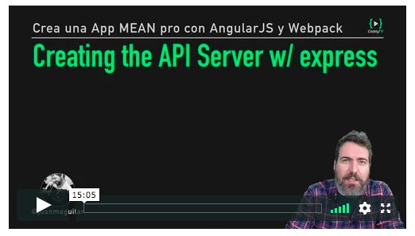

# Montando un servidor API con express

En esta lección crearemos nuestro servidor express con un primer endpoint a través del cual podremos obtener imagenes desde la API de unsplash

[](https://pro.codely.tv/library/crea-una-app-mean-profesional-con-angularjs-y-webpack)

_Esta lección corresponde al curso [Crea una app MEAN profesional con AngularJS y Webpack](https://pro.codely.tv/library/crea-una-app-mean-profesional-con-angularjs-y-webpack) disponible a través de [CodelyTV](https://pro.codely.tv/)_


## Preparando nuestro entorno de desarrollo en el servidor

Partimos de este `package.json` con las dependencias necesarias para aplicar el [StandardJS](https://standardjs.com/) a nuestro código

**`package.json`**
```
{
  "name": "server-proxy-api-unsplash",
  "version": "1.0.0",
  "description": "",
  "main": "index.js",
  "keywords": [],
  "author": "",
  "license": "ISC",
  "devDependencies": {
    "babel-eslint": "^8.0.2",
    "eslint-config-standard": "^10.2.1",
    "eslint-plugin-import": "^2.8.0",
    "eslint-plugin-node": "^5.2.1",
    "eslint-plugin-promise": "^3.6.0",
    "eslint-plugin-standard": "^3.0.1",
    "prettier-eslint": "^8.2.1"
  }
}
```

Instalamos las dependencias del `package.json` con `npm init`

Tenemos que crear tambien `.eslintrc` como ya hicimos en la lección anterior
**`.eslintrc`**

```
{
  "parser": "babel-eslint",
  "extends": [
    "standard"
  ]
}
```

Para reiniciar automaticamente nuestro proceso node cada vez que grabemos utilizaremos [nodemon](https://github.com/remy/nodemon) que instalamos haciendo `npm i -D nodemon`

Con esto creamos un par de scripts para lanzar nuestro servidor desde NPM

```
"scripts": {
  "start": "node index",
  "dev": "nodemon index"
}
```

## Cargando variables de entorno desde node.js

Una manera muy cómoda de cargar de golpe varias variables de entorno es utilizando el módulo [`dotenv`](https://github.com/motdotla/dotenv) que instalamos haciendo `npm i -S dotenv`

Con esto podemos cargar todas las variables definidas en un archivo `.env` haciendo 

```
require('dotenv').load()
```

A partir de este momento, todas las variables de entorno definidas en el `.env` estaran disponible en `process.env`


## Obtener las credenciales de la API de Unsplash

- Ve a https://unsplash.com/oauth/applications y registra una nueva app
- Obtén un `Application ID` y una palabra `Secret` para acceder a esta API
- Añade estos datos como variables de entorno y cárgalas en tu app utilizando `dotenv`

La URL para buscar fotos en la API de unsplash es 

```
https://api.unsplash.com//search/photos/?query=${query}&client_id=${UNSPLASH_CLIENT_ID}&page=${page}&per_page=100
```

## Crear el endpoint de busqueda utilizando la API de Unsplash

Para crear nuestro servidor web utilizamos [express](http://expressjs.com/) y para hacer peticiones a la API de unsplash utilizamos [request-promise](https://github.com/request/request-promise) ([request](https://github.com/request/request) en modo promesa)

```
npm i -S express
npm i -S request request-promise
````

## Probar el endpoint

Para probar los endpoints podemos utilizar [cUrl](https://curl.haxx.se/) (desde el terminal) o la app de Chrome [Postman](https://www.getpostman.com/) (más visual)


