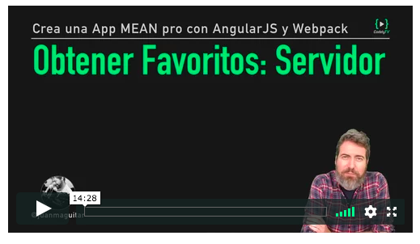

# Obtener Favoritos (Servidor)

En esta lección vamos a crear el endpoint `[GET] /favorites` que nos dará los favoritos de un usuario que le pasaremos por cabecera



## Ampliando nuestro servicio con `addFavorite` y `getFavorites`

Centralizamos la logica de consultas a BD a través del servicio dejandolo así, tal y como explicamos en el video...

**`services/unsplashApi.js`**
```
const getAndCache = require('../utils/getAndCache')
const { UNSPLASH_BASE_URL, UNSPLASH_CLIENT_ID } = process.env
const User = require('../models/User')

const getDetailPhotoUrl = idPhoto =>
`${UNSPLASH_BASE_URL}/photos/${idPhoto}?client_id=${UNSPLASH_CLIENT_ID}`

function getSearchResults (query, page) {
  const urlBase = `${UNSPLASH_BASE_URL}/search/photos/`
  const queryParams = `?query=${query}&client_id=${UNSPLASH_CLIENT_ID}&page=${page}&per_page=100`
  return getAndCache(urlBase + queryParams)
}

function addFavorite (user_id, favorite_id) {
  return User.findOneAndUpdate(
    { user_id },
    {
      $push: { favorites: favorite_id }
    }
  )
}

function removeFavorite (user_id, favorite_id) {
  return User.findOneAndUpdate(
    { user_id },
    {
      $pull: { favorites: favorite_id }
    }
  )
}

function getFavorites (user_id) {
  return User.findOne({ user_id })
            .then( ({ favorites }) => favorites.map( idPhoto => getDetailPhotoUrl(idPhoto)) )
            .then( urls => Promise.all( urls.map( url => getAndCache(url)) ) )
}

module.exports = { getSearchResults, addFavorite, removeFavorite, getFavorites }
```

## Creando el endpoint `[GET] /favorites`

Así nuestro endpoint queda definido con la función `getFavorites` así...

**`routes/handlers/getFavorites.js`**
```
const { getFavorites } = require('../../services/unsplashApi')

function _getFavorites (req, res) {
  const { user_id } = req.headers
  getFavorites(user_id)
    .then(data => res.json(data))
    .catch(error => res.json({error}))
}

module.exports = _getFavorites
```

Como podeis ver, nuestro _route handler_ no sabe los detalles de cómo obtener los favoritos, pero sí los detalles de cómo obtener el `user_id` que hay que pasarle a `getFavorites`

## Recursos

- http://mongoosejs.com/docs/api.html#query_Query-findOne
- https://docs.mongodb.com/manual/reference/operator/update/push/
- https://docs.mongodb.com/v3.0/reference/operator/update/pull/
- https://developer.mozilla.org/en-US/docs/Web/JavaScript/Reference/Global_Objects/Promise/all